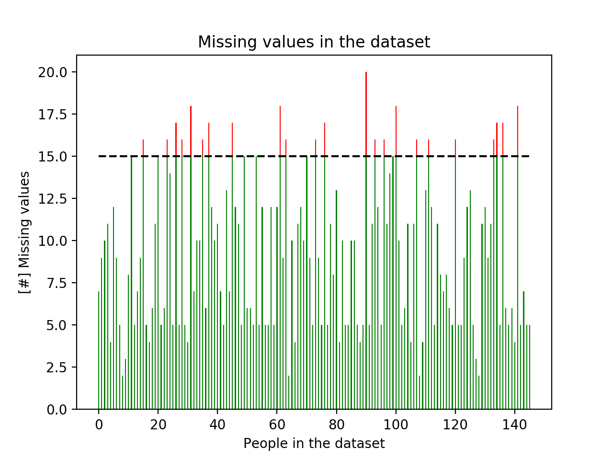
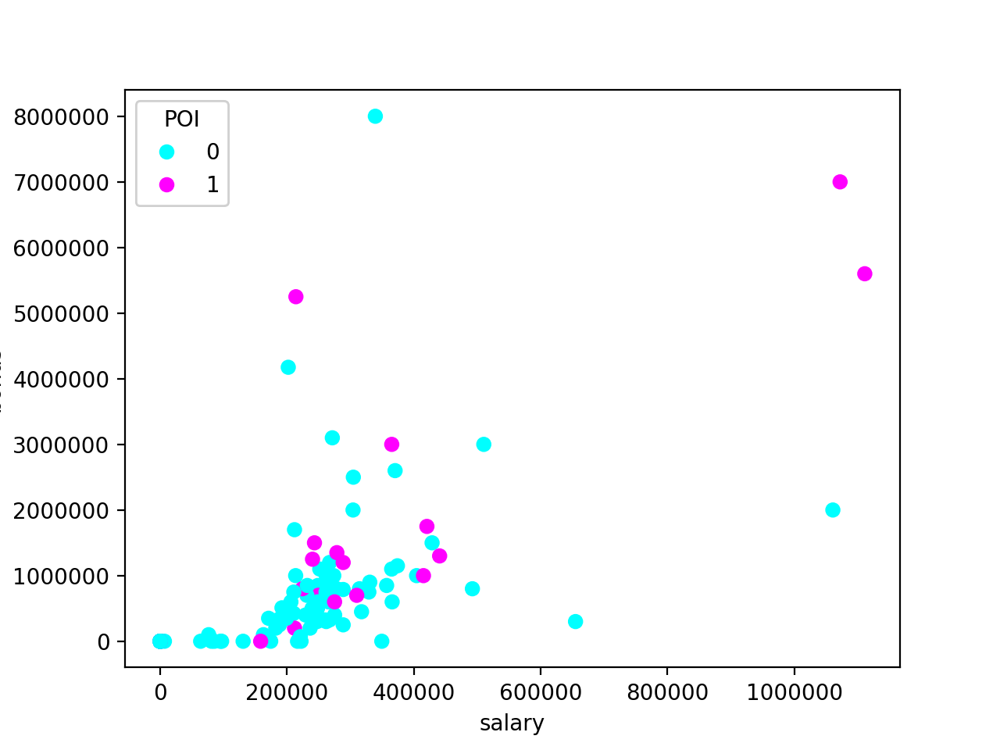
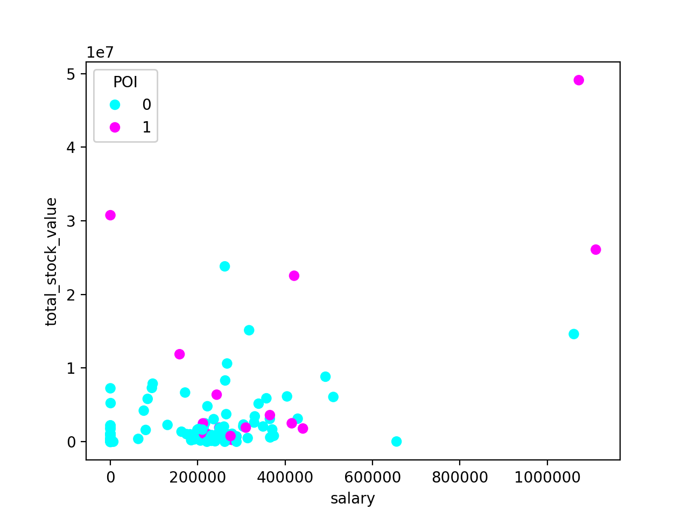
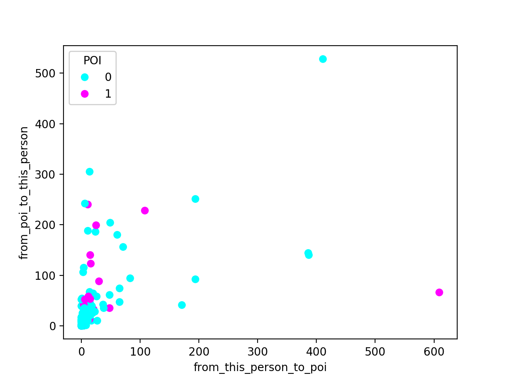
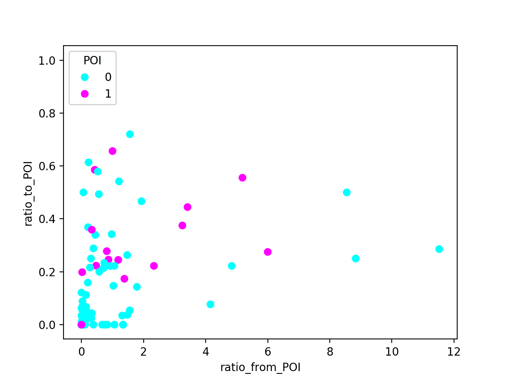

Readme
======

Project Details
---------------

**Project Overview**

In 2000, Enron was one of the largest companies in the United States. By 2002, it had collapsed into bankruptcy due 
to widespread corporate fraud. In the resulting Federal investigation, a significant amount of typically confidential 
information entered into the public record, including tens of thousands of emails and detailed financial data for top 
executives. The aim of this project is to create a person of interest identifier based on financial and email data 
made public as a result of the Enron scandal. A dataset containing this data with a hand-generated list of persons of 
interest in the fraud case, which means individuals who were indicted, reached a settlement or plea deal with the 
government, or testified in exchange for prosecution immunity.

Code
------------------------------

**Code functionality**
The project has been run using Python 3.6. It consists of 2 executables that are contained in the identpoi folder.
- poi_id.py: it is the main executable for the analysis. It creates the poi_id.log, some figures for the data exploration, 
and the final dataset and model.
- tester.py: it is the tester provided with the project adapted to Python 3.6

**Usability**
- poi_id.py can be run to export the dataset, list of features and algorithm, so that the final algorithm can be 
checked easily using tester.py

Understanding the Dataset
-------

**Data Exploration**

This section will answer to the first questions arising from the data exploration.
The data are created with the poi_id script and registered in the poi_id.log
First of all it is important to check the size of the dataset and the number of features.
The dataset consists of 146 samples. For each sample there are 21 features. The number of POI out of the 146 samples is 18,
that means that the dataset is imbalanced. 

Some of the features have a lot of missing values has can be seen from the below figure:
 

It has been decided to take out from the analysis the samples missing more than 15 features.
This means that LOWRY CHARLES P, CHAN RONNIE, WODRASKA JOHN, URQUHART JOHN A, WHALEY DAVID A, MENDELSOHN JOHN, 
CLINE KENNETH W, WAKEHAM JOHN, WROBEL BRUCE, MEYER JEROME J, GATHMANN WILLIAM D, GILLIS JOHN, LOCKHART EUGENE E,
PEREIRA PAULO V. FERRAZ, BLAKE JR. NORMAN P, THE TRAVEL AGENCY IN THE PARK, CHRISTODOULOU DIOMEDES, WINOKUR JR. HERBERT S, 
YEAP SOON, FUGH JOHN L, SCRIMSHAW MATTHEW, SAVAGE FRANK, GRAMM WENDY L will be eliminated from the dataset.
None of them is a POI. 

**Outlier Investigation**

The next step is to look for the outliers. The first step was to check the maximum and the minimum value for each feature within the
samples. It was easy to spot that the maximum was always the TOTAL, being the last line of the pdf with the financial data.
TOTAL has been removed from the dataset.

The following plot have been created to see whether there was an easy correlation between the financial figures or the emails
sent or received from a POI and being a POI.

The images show that there is no an easy correlation and some of the extremes are actually POIs. This means that we will need
to use some machine learning algorithms to find hyper-dimensional correlations.

Feature Engineering
--------

**New features**

Looking at the last figure of the previous section it is impossible to see a clear trend between the mails sent or received from POIs and
being a POI. This statistics could be polluted by the number of the emails sent or received.
In example sending 10 mails out of 15 to a POI, should count more than sending 20 out of 200. 

For this reason 3 new features have been created and added to the dataset:
- the ratio between the emails sent to a POI and the emails sent
- the ratio between the emails sent to a POI and the emails sent
- 

At least one new feature is implemented. Justification for that feature is provided in the written response. The effect 
of that feature on final algorithm performance is tested or its strength is compared to other features in feature 
selection. The student is not required to include their new feature in their final feature set.

**Intelligently select features (related lesson: "Feature Selection")**
Univariate or recursive feature selection is deployed, or features are selected by hand (different combinations of 
features are attempted, and the performance is documented for each one). Features that are selected are reported and 
the number of features selected is justified. For an algorithm that supports getting the feature importances 
(e.g. decision tree) or feature scores (e.g. SelectKBest), those are documented as well.

**Properly scale features (related lesson: "Feature Scaling")**
If algorithm calls for scaled features, feature scaling is deployed.

Pick and Tune an Algorithm
--------------

**Pick an algorithm (related lessons: "Naive Bayes" through "Choose Your Own Algorithm")**
Response addresses what it means to perform parameter tuning and why it is important.

**Discuss parameter tuning and its importance.**
At least one important parameter tuned with at least 3 settings investigated systematically, or any of the following
 are true:

- GridSearchCV used for parameter tuning
- Several parameters tuned
- Parameter tuning incorporated into algorithm selection (i.e. parameters tuned for more than one algorithm, and best
 algorithm-tune combination selected for final analysis).

Validate and Evaluate
-------
**Usage of Evaluation Metrics (related lesson: "Evaluation Metrics")**
At least two appropriate metrics are used to evaluate algorithm performance (e.g. precision and recall), and the 
student articulates what those metrics measure in context of the project task.

**Discuss validation and its importance.**
Response addresses what validation is and why it is important.

**Validation Strategy (related lesson "Validation")**
Performance of the final algorithm selected is assessed by splitting the data into training and testing sets or 
through the use of cross validation, noting the specific type of validation performed.

**Algorithm Performance**
When tester.py is used to evaluate performance, precision and recall are both at least 0.3.

Questions
---------

Summarize the goal of this project and how machine learning is useful in trying to accomplish it. As part of your answer, give some background on the dataset and how it can be used to answer the project question. Were there any outliers in the data when you got it, and how did you handle those?  [relevant rubric items: “data exploration”, “outlier investigation”]

What features did you end up using in your POI identifier, and what selection process did you use to pick them? Did you have to do any scaling? Why or why not? As part of the assignment, you should attempt to engineer your own feature that does not come ready-made in the dataset -- explain what feature you tried to make, and the rationale behind it. (You do not necessarily have to use it in the final analysis, only engineer and test it.) In your feature selection step, if you used an algorithm like a decision tree, please also give the feature importances of the features that you use, and if you used an automated feature selection function like SelectKBest, please report the feature scores and reasons for your choice of parameter values.  [relevant rubric items: “create new features”, “intelligently select features”, “properly scale features”]

What algorithm did you end up using? What other one(s) did you try? How did model performance differ between algorithms?  [relevant rubric item: “pick an algorithm”]

What does it mean to tune the parameters of an algorithm, and what can happen if you don’t do this well?  How did you tune the parameters of your particular algorithm? What parameters did you tune? (Some algorithms do not have parameters that you need to tune -- if this is the case for the one you picked, identify and briefly explain how you would have done it for the model that was not your final choice or a different model that does utilize parameter tuning, e.g. a decision tree classifier).  [relevant rubric items: “discuss parameter tuning”, “tune the algorithm”]

What is validation, and what’s a classic mistake you can make if you do it wrong? How did you validate your analysis?  [relevant rubric items: “discuss validation”, “validation strategy”]

Give at least 2 evaluation metrics and your average performance for each of them.  Explain an interpretation of your metrics that says something human-understandable about your algorithm’s performance. [relevant rubric item: “usage of evaluation metrics”]

